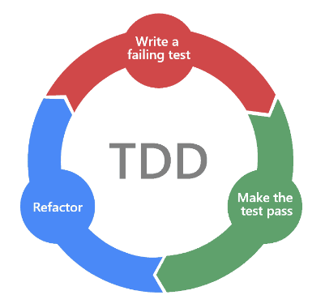

아이템 10. 단위 테스트를 만들어라
=========================
사실 코드를 안전하게 만드는 가장 궁극적인 방법은 다양한 종류의 테스트를 하는 것이다.
테스트는 개발자 관점에서 애플리케이션 내부적으로 올바르게 작동하는지 확인하는 것이 아니라 사용자 관점에서 애플리케이션 외부적으로 제대로 작동하는지 확인하는 게 목표이다.
해당 요소가 올바르게 작동한다는 것을 보증하고 개발 시점에 빠르게 피드백을 받으려면 단위 테스트(unit test)가 필요하다.

#### 단위 테스트에서 확인하는 내용
* 일반적인 유스 케이스(happy path): 요소가 사용될 거라 예상되는 일반적인 방법을 테스트한다.
* 일반적인 오류 케이스와 잠재적인 문제: 제대로 동작하지 않을 거라고 예상되는 일반적인 부분, 과거에 문제가 있었던 부분 등을 테스트한다. 
* 엣지 케이스와 잘못된 아규먼트: Int의 경우 Int.MAX_VALUE를 사용하는 경우, nullable의 경우 null 또는 null값으로 채워진 객체를 쓰는 경우를 의미한다. 이런 경우를 테스트할 수 있다.

단위 테스트는 개발자가 만들고 있는 요소가 제대로 동작하는지를 빠르게 피드백해주므로 개발하는 동안 큰 도움이 된다. 테스트는 계속 축적되므로 ❗회귀 테스트도 쉽다.
TDD(Test Driven Development)라는 접근 방식도 있다. TDD는 개발 전에 테스트를 먼저 작성하고 테스트를 통과시키는 걸 목적으로 하나하나 구현해 가는 방식이다.

#### 회귀 테스트와 임의 테스트
* Regression Test(회귀 테스트): 이미 테스트된 프로그램의 테스팅을 반복하는 것으로, 결함 수정 이후 변경의 결과로 새롭게 만들어 지거나, 이전 결함으로 인해 발견되지 않았던 또 다른 결함을 발견하는 테스트
* Ad-hoc Test(임의 테스트): 사전에 정의된 테스트 계획 없이 테스터가 임의로 테스트를 실행하는 접근 방식이다. 주로 테스트 활동을 빠르게 수행하고자 할 때 사용된다. 사전 계획 없이 빠르게 테스트를 진행하며, 특정 결함이나 문제를 발견하는 데 초점을 맞출 수 있다.

#### TDD 개발 주기
* Red: 실패하는 테스트 코드를 먼저 작성
* Green: 테스트 코드를 성공시키기 위한 실제 코드를 작성
* Blue: 중복 코드 제거, 일반화 등의 리팩토링을 수행

#### 단위 테스트 장점과 단점
* 장점
  * 테스트가 잘 된 코드는 신뢰할 수 있다.
  * 리팩토링이 어렵지 않다. 리팩토링했을 때 버그를 쉽게 확인할 수 있다.
  * 수동으로 테스트하는 것보다 빠르다. 빠른 속도의 피드백 루프가 만들어지고 버그를 빨리 찾을 수 있으므로 버그를 수정하는 비용도 줄어든다.
* 단점
  * 단위 테스트를 만드는 데 시간이 걸린다. 단, 장기적으로는 디버깅 시간과 버그를 찾는데 소모되는 시간을 줄여 준다.
  * 테스트를 활용할 수 있게 코드를 조정해야 한다. 변경은 어렵지만 잘 정립된 아키텍처를 사용하는 것이 강제된다.
  * 좋은 단위 테스트를 만드는 것은 어렵다. 잘못 만들어진 단위 테스트는 득보다 실이 크다.

아래와 같은 부분에 대해 단위 테스트하는 방법을 알고 있어야 한다. 
* 복잡한 부분
* 계속해서 수정이 일어나고 리팩토링이 일어날 수 있는 부분 
* 비즈니스 로직 부분 
* 공용 API 부분 
* 문제가 자주 발생하는 부분 
* 수정해야 하는 프로덕션 버그

### 정리
테스트 중에서 개발 과정에서 가장 효율적으로 활용할 수 있는 테스트는 단위 테스트이다.